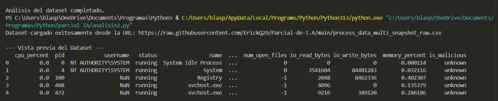
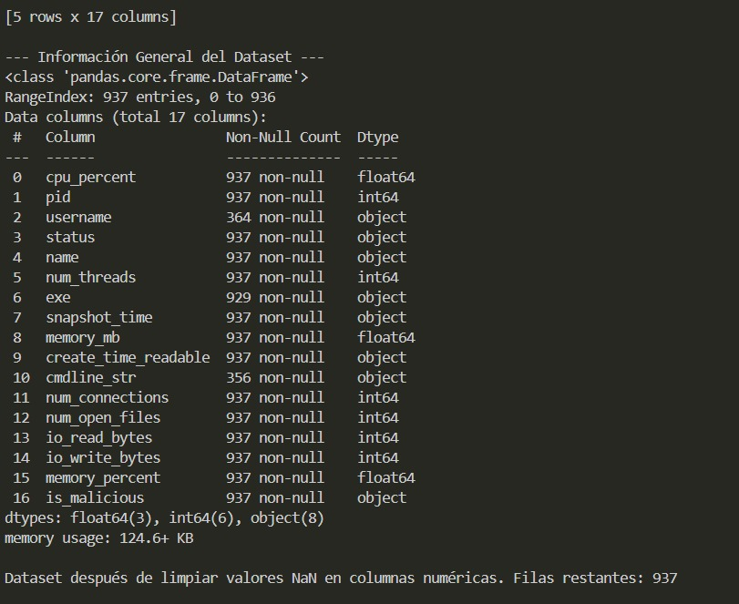
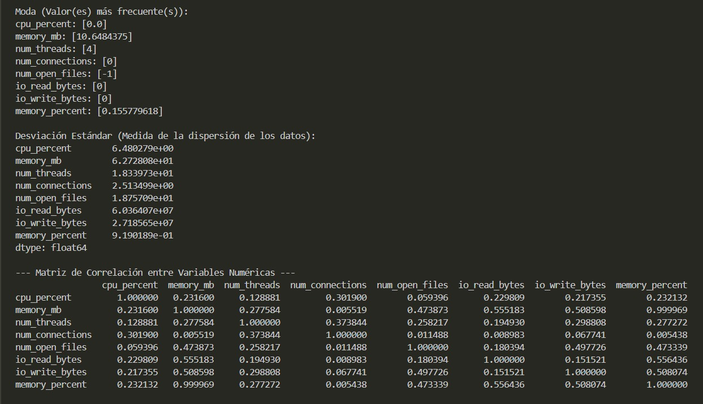
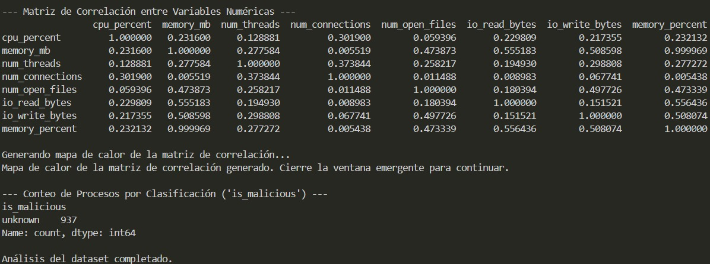
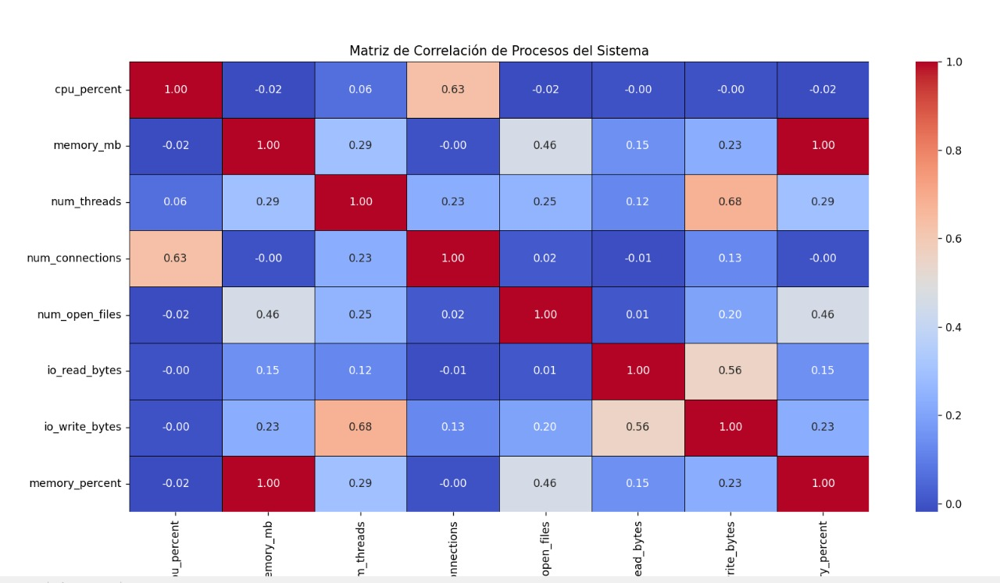

# 🧠 Análisis de Procesos Activos del Sistema

> Parcial práctico de **Erick Quiroz** y **Blas Batista**  
> Universidad Tecnológica de Panamá 🇵🇦  
> *(con posible aparición estelar de Gemini)*

---

## 📘 Descripción

Este proyecto en Python permite la **recopilación y análisis estadístico de procesos activos** del sistema operativo (compatible con **Windows**, **Linux** y **macOS**). 

Está diseñado como una herramienta educativa y de monitoreo inicial, con el potencial de extenderse hacia la **detección de comportamiento anómalo o malicioso** mediante técnicas de Machine Learning.

---

## 🎯 Objetivo

- Construir un dataset de procesos del sistema operativo utilizando Python.
- Analizar dicho dataset mediante estadísticas descriptivas y correlaciones.
- Visualizar relaciones entre variables para detectar patrones de uso de recursos.

---

## 🧩 Estructura del Proyecto

El proyecto se compone de dos scripts principales:

### 📍 `generacion.py`

> 🔍 Recopila múltiples snapshots de los procesos activos.

- Captura datos cada 15 segundos, 4 veces (1 minuto total).
- Guarda la información en `process_data_multi_snapshot_raw.csv`.

#### ✅ Datos Recopilados:

- PID, nombre, ruta del ejecutable
- Usuario, CPU, RAM (MB), %RAM
- Número de hilos, estado del proceso
- Tiempo de inicio, argumentos de línea de comandos
- Archivos abiertos, conexiones de red
- Bytes leídos/escritos por E/S

---

### 📍 `analisis.py`

> 📊 Carga y analiza el dataset generado.

#### Análisis Realizado:

- Estadísticas: media, mediana, moda, desviación estándar
- Matriz de correlación entre métricas numéricas
- Visualización: mapa de calor con `seaborn`

---

## 🖼️ Capturas de el trabajo

### 🔥 Mapa de Calor de Correlaciones

> Visualización generada con `seaborn` a partir del CSV

---

### 📟 Terminal Ejecutando el Análisis

---

### 📟 Terminal Ejecutando el Análisis

---

### 📟 Terminal Ejecutando el Análisis

---

### 📟 Terminal Ejecutando el Análisis

---

### 📟 Terminal Ejecutando el Análisis

---

# 📊 Interpretación del Análisis de Datos

El análisis estadístico y la matriz de correlación generados con Python permiten extraer las siguientes observaciones clave del dataset de procesos del sistema:

## 📈 Estadísticas básicas

### Promedios:
- **cpu_percent:** 0.97 → la mayoría de los procesos usan poca CPU.  
- **memory_mb:** 32 MB en promedio → bajo uso de memoria individual.  
- **num_threads:** 10.6 → procesos multihilo activos.  
- **num_connections:** 6.56 conexiones por proceso → posible actividad de red frecuente.

### Moda y mediana:
- Valores más frecuentes en `cpu_percent`, `io_write_bytes`, `num_connections` son 0 → muchos procesos están inactivos o sin actividad I/O significativa.

### Desviación estándar:
- Alta dispersión en `memory_mb` e `io_write_bytes` → hay procesos mucho más intensivos que otros (como navegadores, servicios de actualización o posibles amenazas).

---

## 🔍 Matriz de correlación: relaciones destacadas

- `memory_mb` y `memory_percent`: correlación ≈ 1.0 → expresan la misma métrica en diferentes unidades.  
- `memory_mb` con `io_read_bytes` y `io_write_bytes`: correlación moderada (~0.50) → procesos con más RAM también hacen más I/O.  
- `cpu_percent` con `num_connections`: correlación positiva (~0.30) → podría ayudar a detectar procesos que se comunican frecuentemente.  
- `num_threads` con `io_write_bytes`: correlación relevante → procesos paralelos que escriben mucho (como logs o cifrado en malware).

---

## 🛡 Observación sobre `is_malicious`

Todos los procesos están marcados como `"unknown"` actualmente.  
Esto no afecta el análisis estadístico, pero si se desea implementar modelos de clasificación o detección de amenazas, se recomienda etiquetar manualmente algunos procesos como `"legitimate"` o `"malicious"`.

---

## ✅ Conclusión

Este análisis demuestra cómo, utilizando Python y sus librerías (`psutil`, `pandas`, `seaborn`), es posible:

- Obtener métricas detalladas de uso del sistema.  
- Detectar patrones clave y relaciones útiles.  
- Sentar la base para futuras aplicaciones de detección de anomalías o análisis de malware.

---

## 🤝 Autores

Desarrollado por:  
- **Erick Quiroz**  
- **Blas Batista**  
- *(posiblemente Gemini metió mano también 😅)*
